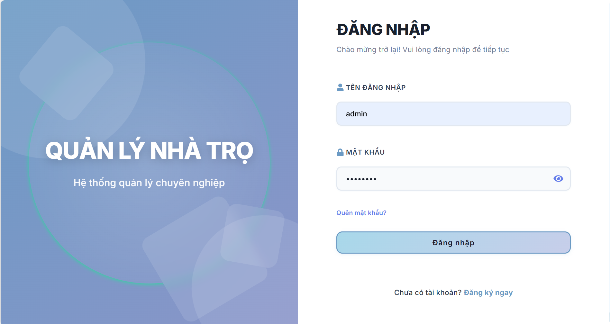
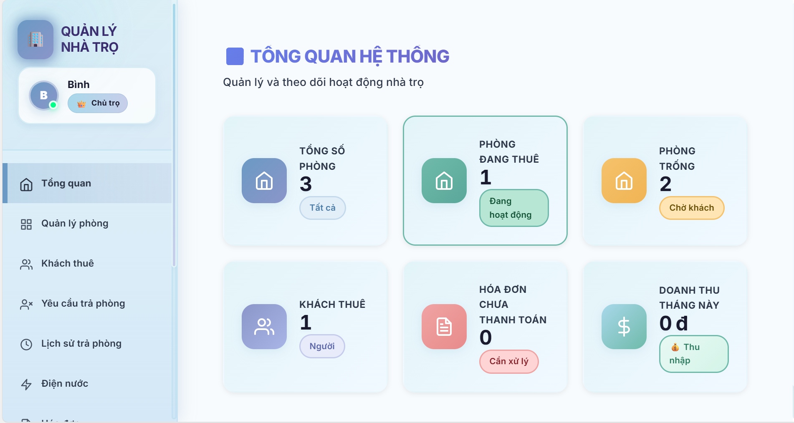
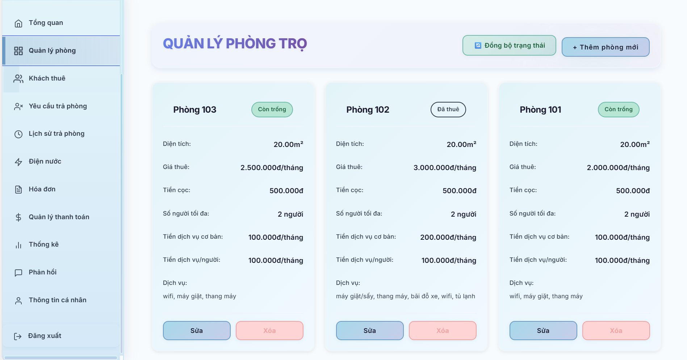
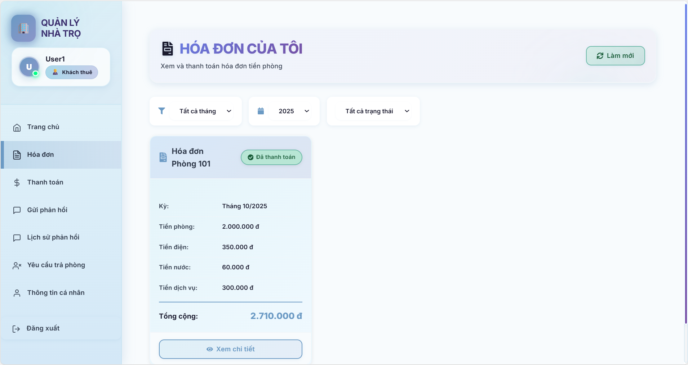

<h2 align="center">
    <a href="https://dainam.edu.vn/vi/khoa-cong-nghe-thong-tin">
    🎓 Faculty of Information Technology (DaiNam University)
    </a>
</h2>
<h2 align="center">
   Hệ thống quản lý nhà trọ
</h2>
<div align="center">
    <p align="center">
        
        
        
    </p>

[](https://www.facebook.com/DNUAIoTLab)
[](https://dainam.edu.vn/vi/khoa-cong-nghe-thong-tin)
[](https://dainam.edu.vn)

</div>

## 1. Giới thiệu hệ thống
Hệ thống Quản lý Nhà trọ Client-Server được xây dựng theo mô hình Web (REST API) với Backend (Express.js) và Frontend (React). Người dùng đăng nhập, thao tác quản lý phòng/khách thuê/hóa đơn qua giao diện web. Máy chủ tiếp nhận yêu cầu từ client, xử lý nghiệp vụ và lưu trữ dữ liệu trong MySQL.

- Phía Admin (Chủ trọ): giao diện quản trị trực quan để Thêm/Sửa/Xóa phòng, khách thuê, ghi chỉ số điện nước, tạo hóa đơn, duyệt thanh toán, duyệt trả phòng, xem lịch sử.
- Phía Khách thuê: xem thông tin phòng, hóa đơn, thanh toán, gửi phản hồi, yêu cầu/thu hồi trả phòng.

Lưu ý: README này được biên soạn lại theo sườn mẫu mà bạn cung cấp (các mục và bố cục), nhưng nội dung đã được điều chỉnh phù hợp với công nghệ dự án (Node.js/Express + React + MySQL) thay vì Java/JDBC/TCP.

---

## 2. Công nghệ sử dụng  
<div align="center">

<a href="https://nodejs.org/"></a>
<a href="https://expressjs.com/"></a>
<a href="https://react.dev/"></a>
<a href="https://www.mysql.com/"></a>
<a href="https://jwt.io/"></a>
<a href="https://axios-http.com/"></a>

</div>

Trong đó:
- Node.js + Express: Xây dựng REST API backend, xác thực JWT, xử lý cron job.
- React: Xây dựng giao diện web cho Admin và Khách thuê.
- MySQL: Lưu trữ dữ liệu. File schema hợp nhất: `database/database.sql`.
- Axios: Gọi API từ frontend.
- JWT + bcryptjs + multer: Xác thực, mã hóa mật khẩu, upload.

---

## 3. Một số hình ảnh hệ thống

Bạn có thể đặt ảnh minh họa vào thư mục `docs/` và tham chiếu như bên dưới. Nếu chưa có, hãy tạo thư mục `docs` và thêm ảnh sau.

<div align="center">

<table>
  <tr>
    <td align="center">
      <br/>
      <b>Màn hình đăng nhập</b>
    </td>
    <td align="center">
      <br/>
      <b>Dashboard Chủ trọ</b>
    </td>
  </tr>
  <tr>
    <td align="center">
      <br/>
      <b>Quản lý phòng</b>
    </td>
    <td align="center">
      <br/>
      <b>Hóa đơn của tôi (Khách thuê)</b>
    </td>
  </tr>
</table>

</div>

---

## 4. Các bước cài đặt

### 4.1. Cài đặt môi trường
- Cài đặt Node.js LTS (18+): https://nodejs.org/
- Cài đặt MySQL Server: https://dev.mysql.com/downloads/
- Git (khuyến nghị): https://git-scm.com/downloads

IDE gợi ý: VS Code (với các extension cho JavaScript/React).

### 4.2. Clone source code
Mở PowerShell và chạy:

```powershell
git clone <repository-url>
cd quan_ly_nha_tro
```

### 4.3. Khởi tạo cơ sở dữ liệu MySQL
Bạn có 2 cách:

1) Dùng MySQL Workbench: Mở file `database/schema_hoan_chinh.sql` và Run toàn bộ.

2) Dùng MySQL CLI (PowerShell):

```powershell
# Nếu DB chưa tồn tại, script sẽ tạo mới các bảng (có IF NOT EXISTS)
mysql -u root -p < database\database.sql
```

Sau khi import, CSDL sẵn sàng với đầy đủ 13 bảng (nguoi_dung, phong, khach_thue, hop_dong, dien_nuoc, hoa_don, thanh_toan, phan_hoi, danh_gia, thong_bao, yeu_cau_tra_phong, lich_su_tra_phong,...).

### 4.4. Cấu hình kết nối Backend (.env)
Tạo file `.env` trong thư mục `backend/`:

```env
PORT=5001
DB_HOST=localhost
DB_USER=root
DB_PASSWORD=your_password
DB_NAME=quan_ly_nha_tro
JWT_SECRET=your_secret_key_here
```

### 4.5. Cài đặt và chạy chương trình

1) Cài đặt dependencies

```powershell
# Backend
cd backend
npm install

# Frontend
cd ..\frontend
npm install
```

2) Chạy hệ thống (2 terminal riêng)

```powershell
# Terminal 1 - Backend
cd backend
npm start

# Terminal 2 - Frontend
cd frontend
npm start
```

- Backend: http://localhost:5001
- Frontend: http://localhost:3000

### 4.6. Kiểm tra kết quả

Đăng nhập bằng tài khoản mẫu (nếu đã tạo qua migrate hoặc seed):
- Admin: admin / 123456
- Khách thuê: user1 / 123456

Kỳ vọng:
- Server log báo kết nối DB thành công, Cron chạy định kỳ 1h.
- Frontend hiển thị màn hình đăng nhập, sau đó vào Dashboard phù hợp vai trò.

---

## Lưu ý
- Đảm bảo MySQL đang chạy trước khi khởi động Backend.
- Sửa đúng thông tin `.env` (DB_USER, DB_PASSWORD...).
- Backend phải chạy trước khi Frontend gọi API.
- Với production, hãy đặt JWT_SECRET đủ mạnh và cấu hình CORS/HTTPS phù hợp.

---

## Phụ lục: Tính năng chính (tóm tắt)

Admin (Chủ trọ):
- Quản lý phòng, khách thuê, điện nước, hóa đơn, thanh toán.
- Duyệt/từ chối yêu cầu trả phòng; xem lịch sử trả phòng.
- Thống kê tổng quan.

Khách thuê:
- Xem thông tin phòng, hóa đơn của tôi, thanh toán, gửi phản hồi.
- Gửi/thu hồi yêu cầu trả phòng; theo dõi trạng thái.

Cron tự động (mỗi 1 giờ):
- Sau khi yêu cầu trả phòng được duyệt và quá 24h: lưu lịch sử, xóa khách thuê, xóa tài khoản thuê (nếu có), cập nhật phòng về "trống".

---


## 📞 5. Liên hệ cá nhân  
- 👨‍🎓 **Người thực hiện**: Đặng Thanh Bình
- 🎓 **Khoa**: Công nghệ thông tin – Trường Đại học Đại Nam
- 📞 **Số điện thoại**: 0822968881
- 📧 **Email**: dnagbinh12@gmail.com